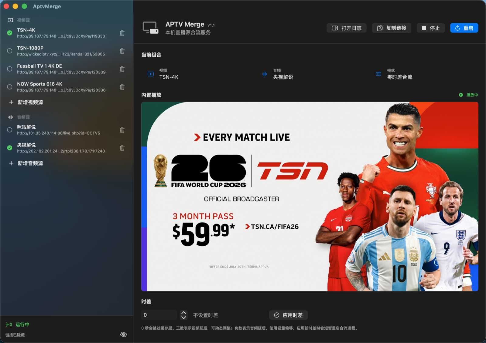

# AptvMerge

AptvMerge is a macOS SwiftUI app that merges one live video stream and one live commentary/audio stream into a local HLS output.

It is designed for local network playback with apps such as APTV, Apple TV players, or any HLS-compatible client. The app also includes an in-app preview player.



## Features

- Merge a video live stream with a separate audio/commentary live stream.
- Serve the merged HLS stream on the local network, for example `http://<mac-lan-ip>:8080/index.m3u8`.
- Preview playback inside the app through a local fMP4 HLS stream.
- Add, edit, delete, and manually reorder video/audio sources.
- Calibrate video/audio sync with side-by-side source previews before merging.
- Confirm merge from the calibrated source timeline so the merged output follows the calibrated sync result.
- Fine-tune sync delay:
  - `0`: direct merge with no buffer layer.
  - Positive value: delay video.
  - Negative value: delay audio.
- Hide or reveal the output URL in the UI.
- View runtime logs in a right-side log panel.

## Runtime Requirements

- macOS 13 or later.
- Python 3.
- FFmpeg.

Xcode is not required if you install a prebuilt release. Xcode is only needed when building AptvMerge from source.

Install FFmpeg with Homebrew:

```bash
brew install ffmpeg
```

AptvMerge looks for FFmpeg in:

```text
/opt/homebrew/bin/ffmpeg
/usr/local/bin/ffmpeg
/opt/local/bin/ffmpeg
```

Python is expected at one of:

```text
/usr/bin/python3
/opt/homebrew/bin/python3
/usr/local/bin/python3
```

## Install Prebuilt App

Download the latest `AptvMerge.zip` from the GitHub Releases page:

```text
https://github.com/252201/AptvMerge/releases
```

Unzip it, then move `AptvMerge.app` into `/Applications`.

Launch it with:

```bash
open /Applications/AptvMerge.app
```

The release build is not notarized. If macOS blocks the first launch, right-click `AptvMerge.app`, choose **Open**, then confirm once.

## Build From Source

Building from source requires Xcode.

Clone the repository:

```bash
git clone https://github.com/252201/AptvMerge.git
cd AptvMerge
```

Build a Debug app:

```bash
xcodebuild -project AptvMerge.xcodeproj -scheme AptvMerge -configuration Debug -destination 'platform=macOS' build
```

Build a Release app:

```bash
xcodebuild -project AptvMerge.xcodeproj -scheme AptvMerge -configuration Release -destination 'generic/platform=macOS' build
```

You can also open `AptvMerge.xcodeproj` in Xcode and run the `AptvMerge` scheme.

## Install A Local Build

After a Release build, copy the generated app into `/Applications`:

```bash
release_app=$(find "$HOME/Library/Developer/Xcode/DerivedData" -path '*/Build/Products/Release/AptvMerge.app' -type d -print -quit)
cp -R "$release_app" /Applications/
```

Then launch:

```bash
open /Applications/AptvMerge.app
```

## Usage

1. Select a video source from the left video list.
2. Select an audio/commentary source from the left audio list.
3. Click **Start** to enter sync calibration.
4. Use the two preview panes to align the video source and audio/commentary source:
   - Increase the video delay when the video should play later.
   - Increase the audio delay when the commentary should play later.
5. Click **Confirm Merge** after the previews are in sync.
6. Reveal or copy the generated HLS URL.
7. Open the URL from APTV, Apple TV, or another device on the same LAN.

The in-app preview starts automatically after the local preview stream is ready.

You can still fine-tune the delay after merging with the delay control in the main panel. When the merge was started from calibration, AptvMerge keeps using the existing calibrated local source timeline instead of reconnecting to the remote sources.

### Manage Sources

- Click the plus row under **Video Sources** or **Audio Sources** to add a source.
- Click the pencil button on a source row to edit its name, URL, or User-Agent.
- Click the play button to preview a single source inside the app.
- Drag source rows within their section to reorder them.
- Use the row context menu for **Edit**, **Move Up**, **Move Down**, or **Delete**.

## Local Data

User-edited sources are stored locally at:

```text
~/Library/Application Support/AptvMerge/sources.json
```

Runtime logs are stored locally at:

```text
~/Library/Application Support/AptvMerge/logs/current.log
~/Library/Application Support/AptvMerge/logs/session-YYYYMMDD-HHMMSS.log
```

Runtime HLS files are written under:

```text
~/Library/Application Support/AptvMerge/Runtime/
```

## Troubleshooting

If startup fails, check the current log:

```bash
tail -n 200 "$HOME/Library/Application Support/AptvMerge/logs/current.log"
```

Common causes:

- FFmpeg is not installed or not in one of the supported paths.
- Port `8080` is already in use.
- The selected stream source is unavailable.
- macOS Firewall blocks local network access to the Python HTTP server.
- The playback device is not on the same LAN as the Mac.

Check port `8080`:

```bash
lsof -i :8080
```

## Privacy

AptvMerge does not include analytics, telemetry, accounts, or remote logging. Sources, logs, and runtime files stay on the local Mac unless you share them yourself.

The default video and audio source URLs are included as editable examples. Make sure you have the right to access and use any stream source you configure.

## License

MIT License. See [LICENSE](LICENSE).
